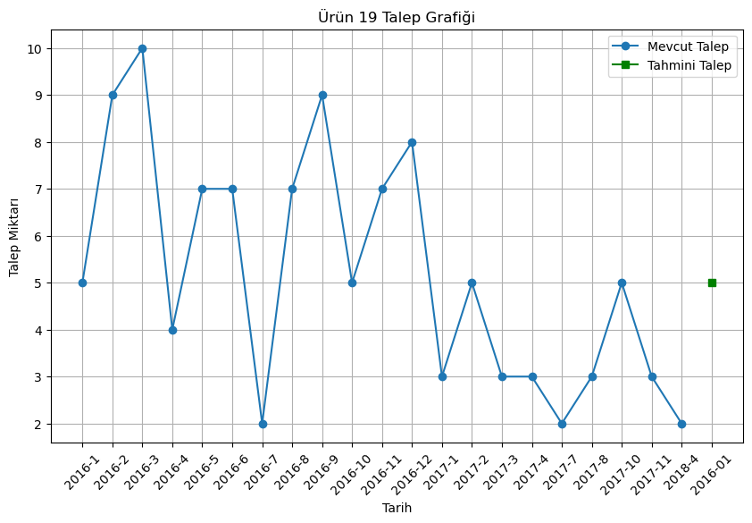
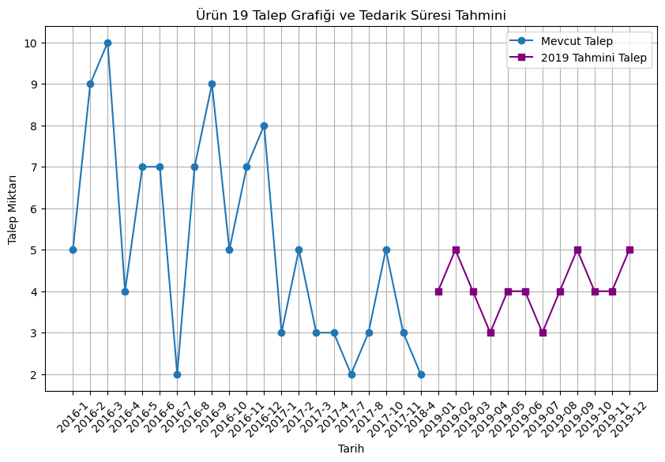

```python
import pandas as pd
from datetime import datetime, timedelta
from sklearn.ensemble import RandomForestRegressor
from sklearn.metrics import mean_squared_error
import matplotlib.pyplot as plt
```


```python
# Verilerinizi yükleyin
brands = pd.read_csv("C:\\Users\\Umut\\Desktop\\brands.csv")
categories = pd.read_csv("C:\\Users\\Umut\\Desktop\\categories.csv")
customers = pd.read_csv("C:\\Users\\Umut\\Desktop\\customers.csv")
orders = pd.read_csv("C:\\Users\\Umut\\Desktop\\orders.csv")
staffs = pd.read_csv("C:\\Users\\Umut\\Desktop\\staffs.csv")
stores = pd.read_csv("C:\\Users\\Umut\\Desktop\\stores.csv")
orders_items = pd.read_csv("C:\\Users\\Umut\\Desktop\\order_items.csv")
stocks = pd.read_csv("C:\\Users\\Umut\\Desktop\\stocks.csv")
products = pd.read_csv("C:\\Users\\Umut\\Desktop\\products.csv")
```


```python
# 'order_date' sütununu datetime türüne dönüştürün
orders['order_date'] = pd.to_datetime(orders['order_date'])

```


```python
# 'order_date', 'required_date' ve 'shipped_date' sütunlarını datetime türüne dönüştürün
orders['order_date'] = pd.to_datetime(orders['order_date'])
orders['required_date'] = pd.to_datetime(orders['required_date'])
orders['shipped_date'] = pd.to_datetime(orders['shipped_date'])
```


```python
# Ay ve yıl bilgilerini içeren yeni sütunlar ekleyin
orders['year'] = orders['order_date'].dt.year
orders['month'] = orders['order_date'].dt.month

```


```python
# Tedarik süresini hesaplamak için bir sütun ekleyin
orders['lead_time'] = (orders['required_date'] - orders['shipped_date']).dt.days

```


```python
# Verileri birleştirin
merged_data = pd.merge(orders_items, orders, on='order_id', how='inner')
```


```python
# Her bir ürünün her aydaki toplam talebini hesaplayın
monthly_demand = merged_data.groupby(['product_id', 'year', 'month'])['quantity'].sum().reset_index()

```


```python
# İlgilenilen ürün ID'sini seçin
product_id = 19

```


```python
# Talep verisini seçin
product_demand = monthly_demand[monthly_demand['product_id'] == product_id].copy()

```


```python
# Özellikleri ve hedefi (target) belirleyin
features = product_demand[['year', 'month']]
target = product_demand['quantity']

```


```python
# Verileri eğitim ve test olarak bölün
train_size = int(0.8 * len(features))
X_train, X_test = features[:train_size], features[train_size:]
y_train, y_test = target[:train_size], target[train_size:]

```


```python
# Modeli oluşturun (Rassal Orman Regresyonu kullanıyoruz)
model = RandomForestRegressor(n_estimators=100, random_state=42)

```


```python
# Modeli eğitin
model.fit(X_train, y_train)
```


<style>#sk-container-id-16 {color: black;}#sk-container-id-16 pre{padding: 0;}#sk-container-id-16 div.sk-toggleable {background-color: white;}#sk-container-id-16 label.sk-toggleable__label {cursor: pointer;display: block;width: 100%;margin-bottom: 0;padding: 0.3em;box-sizing: border-box;text-align: center;}#sk-container-id-16 label.sk-toggleable__label-arrow:before {content: "▸";float: left;margin-right: 0.25em;color: #696969;}#sk-container-id-16 label.sk-toggleable__label-arrow:hover:before {color: black;}#sk-container-id-16 div.sk-estimator:hover label.sk-toggleable__label-arrow:before {color: black;}#sk-container-id-16 div.sk-toggleable__content {max-height: 0;max-width: 0;overflow: hidden;text-align: left;background-color: #f0f8ff;}#sk-container-id-16 div.sk-toggleable__content pre {margin: 0.2em;color: black;border-radius: 0.25em;background-color: #f0f8ff;}#sk-container-id-16 input.sk-toggleable__control:checked~div.sk-toggleable__content {max-height: 200px;max-width: 100%;overflow: auto;}#sk-container-id-16 input.sk-toggleable__control:checked~label.sk-toggleable__label-arrow:before {content: "▾";}#sk-container-id-16 div.sk-estimator input.sk-toggleable__control:checked~label.sk-toggleable__label {background-color: #d4ebff;}#sk-container-id-16 div.sk-label input.sk-toggleable__control:checked~label.sk-toggleable__label {background-color: #d4ebff;}#sk-container-id-16 input.sk-hidden--visually {border: 0;clip: rect(1px 1px 1px 1px);clip: rect(1px, 1px, 1px, 1px);height: 1px;margin: -1px;overflow: hidden;padding: 0;position: absolute;width: 1px;}#sk-container-id-16 div.sk-estimator {font-family: monospace;background-color: #f0f8ff;border: 1px dotted black;border-radius: 0.25em;box-sizing: border-box;margin-bottom: 0.5em;}#sk-container-id-16 div.sk-estimator:hover {background-color: #d4ebff;}#sk-container-id-16 div.sk-parallel-item::after {content: "";width: 100%;border-bottom: 1px solid gray;flex-grow: 1;}#sk-container-id-16 div.sk-label:hover label.sk-toggleable__label {background-color: #d4ebff;}#sk-container-id-16 div.sk-serial::before {content: "";position: absolute;border-left: 1px solid gray;box-sizing: border-box;top: 0;bottom: 0;left: 50%;z-index: 0;}#sk-container-id-16 div.sk-serial {display: flex;flex-direction: column;align-items: center;background-color: white;padding-right: 0.2em;padding-left: 0.2em;position: relative;}#sk-container-id-16 div.sk-item {position: relative;z-index: 1;}#sk-container-id-16 div.sk-parallel {display: flex;align-items: stretch;justify-content: center;background-color: white;position: relative;}#sk-container-id-16 div.sk-item::before, #sk-container-id-16 div.sk-parallel-item::before {content: "";position: absolute;border-left: 1px solid gray;box-sizing: border-box;top: 0;bottom: 0;left: 50%;z-index: -1;}#sk-container-id-16 div.sk-parallel-item {display: flex;flex-direction: column;z-index: 1;position: relative;background-color: white;}#sk-container-id-16 div.sk-parallel-item:first-child::after {align-self: flex-end;width: 50%;}#sk-container-id-16 div.sk-parallel-item:last-child::after {align-self: flex-start;width: 50%;}#sk-container-id-16 div.sk-parallel-item:only-child::after {width: 0;}#sk-container-id-16 div.sk-dashed-wrapped {border: 1px dashed gray;margin: 0 0.4em 0.5em 0.4em;box-sizing: border-box;padding-bottom: 0.4em;background-color: white;}#sk-container-id-16 div.sk-label label {font-family: monospace;font-weight: bold;display: inline-block;line-height: 1.2em;}#sk-container-id-16 div.sk-label-container {text-align: center;}#sk-container-id-16 div.sk-container {/* jupyter's `normalize.less` sets `[hidden] { display: none; }` but bootstrap.min.css set `[hidden] { display: none !important; }` so we also need the `!important` here to be able to override the default hidden behavior on the sphinx rendered scikit-learn.org. See: https://github.com/scikit-learn/scikit-learn/issues/21755 */display: inline-block !important;position: relative;}#sk-container-id-16 div.sk-text-repr-fallback {display: none;}</style><div id="sk-container-id-16" class="sk-top-container"><div class="sk-text-repr-fallback"><pre>RandomForestRegressor(random_state=42)</pre><b>In a Jupyter environment, please rerun this cell to show the HTML representation or trust the notebook. <br />On GitHub, the HTML representation is unable to render, please try loading this page with nbviewer.org.</b></div><div class="sk-container" hidden><div class="sk-item"><div class="sk-estimator sk-toggleable"><input class="sk-toggleable__control sk-hidden--visually" id="sk-estimator-id-16" type="checkbox" checked><label for="sk-estimator-id-16" class="sk-toggleable__label sk-toggleable__label-arrow">RandomForestRegressor</label><div class="sk-toggleable__content"><pre>RandomForestRegressor(random_state=42)</pre></div></div></div></div></div>


```python
# Modeli kullanarak tahminler yapın
y_pred = model.predict(X_test)

```


```python
# Tahminleri değerlendirin (örneğin, RMSE kullanarak)
rmse = mean_squared_error(y_test, y_pred, squared=False)
print(f"RMSE: {rmse}")

```

    RMSE: 1.1479808360769792
    


```python
# İlgilenilen tarihi belirleyin (örnek: 2016-01-01)
target_date = datetime(2016, 1, 1)
```


```python
# İlgilenilen ürün ID'sini seçin
product_id = 19
```


```python
# Tahmini talep miktarını hesaplayın
future_demand = monthly_demand[(monthly_demand['year'] == target_date.year) & (monthly_demand['month'] == target_date.month) & (monthly_demand['product_id'] == product_id)]
```


```python
# Gerçek talep miktarınızı alın (örneğin, 2016, 1, 1)
real_demand = monthly_demand[(monthly_demand['year'] == target_date.year) & (monthly_demand['month'] == target_date.month) & (monthly_demand['product_id'] == product_id)]
```


```python
# Tahmini talep miktarını yazdırın
if len(future_demand) > 0:
    print(f"Ürün {product_id} için tahmini talep miktarı: {future_demand['quantity'].values[0]}")
else:
    print(f"Ürün {product_id} için tahmini talep kaydı bulunamadı.")
```

    Ürün 19 için tahmini talep miktarı: 5
    


```python
# Gerçek talep miktarını yazdırın
if len(real_demand) > 0:
    print(f"Ürün {product_id} için gerçek talep miktarı: {real_demand['quantity'].values[0]}")
else:
    print(f"Ürün {product_id} için gerçek talep kaydı bulunamadı.")

```

    Ürün 19 için gerçek talep miktarı: 5
    


```python
# Doğruluk değerini hesaplayın
if len(future_demand) > 0 and len(real_demand) > 0:
    accuracy = abs(future_demand['quantity'].values[0] - real_demand['quantity'].values[0])
    print(f"Tahmin doğruluğu: {accuracy} birim")
```

    Tahmin doğruluğu: 0 birim
    


```python
# Görselleştirme
plt.figure(figsize=(10, 6))
plt.plot(product_demand['year'].astype(str) + '-' + product_demand['month'].astype(str), product_demand['quantity'], marker='o', label='Mevcut Talep')
if len(real_demand) > 0:
    plt.plot(target_date.strftime('%Y-%m'), real_demand['quantity'].values[0], marker='s', color='green', label='Tahmini Talep')
plt.xlabel('Tarih')
plt.ylabel('Talep Miktarı')
plt.title(f'Ürün {product_id} Talep Grafiği')
plt.xticks(rotation=45)
plt.legend()
plt.grid(True)
plt.show()
```


    

    


```python
# Tahminleri değerlendirin (örneğin, RMSE kullanarak)
rmse = mean_squared_error(y_test, y_pred, squared=False)
print(f"RMSE: {rmse}")

# Gelecekteki tahminler yapmak için aynı modeli kullanabilirsiniz. Örneğin, 2019 için tahmin yapabilirsiniz.
future_predictions = []
for month in range(1, 13):
    future_date = datetime(2019, month, 1)
    future_feature = pd.DataFrame({'year': [future_date.year], 'month': [future_date.month]})
    future_demand = model.predict(future_feature)

    # Gelecekteki tedarik süresi tahmini yapın (örneğin, 2019 yılının Ocak ayı için)
    shipped_date = future_date  # Örnek: 2019 yılı için bir tarih
    required_date = future_date + timedelta(days=future_demand[0])  # Talebe göre tedarik süresi ile gereken tarihi hesapla
    lead_time = (required_date - shipped_date).days  # Tedarik süresi hesaplaması

    future_predictions.append((int(round(future_demand[0])), lead_time))  # Talep tahminini yuvarlayın

# Talep tahminlerini ve tedarik sürelerini yazdırın
for month, (demand, lead) in enumerate(future_predictions, start=1):
    print(f"Ürün {product_id} için {2019}-{month:02} tahmini talep: {demand}, Tedarik Süresi: {lead} gün")

# Görselleştirme güncellemesi
plt.figure(figsize=(10, 6))
plt.plot(product_demand['year'].astype(str) + '-' + product_demand['month'].astype(str), product_demand['quantity'], marker='o', label='Mevcut Talep')
if future_predictions:
    plt.plot([f'2019-{month:02}' for month in range(1, 13)], [demand for demand, _ in future_predictions], marker='s', color='purple', label='2019 Tahmini Talep')
plt.xlabel('Tarih')
plt.ylabel('Talep Miktarı')
plt.title(f'Ürün {product_id} Talep Grafiği ve Tedarik Süresi Tahmini')
plt.xticks(rotation=45)
plt.legend()
plt.grid(True)
plt.show()

```

    RMSE: 1.1479808360769792
    Ürün 19 için 2019-01 tahmini talep: 4, Tedarik Süresi: 3 gün
    Ürün 19 için 2019-02 tahmini talep: 5, Tedarik Süresi: 4 gün
    Ürün 19 için 2019-03 tahmini talep: 4, Tedarik Süresi: 4 gün
    Ürün 19 için 2019-04 tahmini talep: 3, Tedarik Süresi: 3 gün
    Ürün 19 için 2019-05 tahmini talep: 4, Tedarik Süresi: 3 gün
    Ürün 19 için 2019-06 tahmini talep: 4, Tedarik Süresi: 3 gün
    Ürün 19 için 2019-07 tahmini talep: 3, Tedarik Süresi: 3 gün
    Ürün 19 için 2019-08 tahmini talep: 4, Tedarik Süresi: 3 gün
    Ürün 19 için 2019-09 tahmini talep: 5, Tedarik Süresi: 4 gün
    Ürün 19 için 2019-10 tahmini talep: 4, Tedarik Süresi: 4 gün
    Ürün 19 için 2019-11 tahmini talep: 4, Tedarik Süresi: 4 gün
    Ürün 19 için 2019-12 tahmini talep: 5, Tedarik Süresi: 4 gün
    


    

    


```python

```
